**中文** | **[English](README_EN.md)**

# TCL 75T7G 电视 Root 过程

> **设备**：TCL 75T7G（V8-T652T01-LF1V379，MStar MT9652，Android 9.0）<br>
> **完成时间**：2023年4月<br>
> **报告整理时间**：2026-05-12（基于原始笔记整理）

> [!CAUTION]
> **免责声明**
>
> 之前花了点时间把自己家里的一台老旧的电视 Root 了一下，仅限个人学习交流，严禁用于商业用途。所产生的任何后果均与本人无关。如有涉及到隐私安全等问题，请联系我修改。

---

## 一、背景

### 1.1 这台电视的状态

对比普通 Android 工程机（有 Recovery/Bootloader/Fastboot 模式，Root 只需 2 分钟），TCL 75T7G 存在如下限制：

- ❌ 没有 Fastboot 模式 — 无法 `fastboot flash`
- ❌ 没有 Bootloader 解锁 — 无法解锁引导加载程序
- ❌ 没有 Recovery 模式入口 — 无法进入标准 Android Recovery
- ❌ USB 线连接无响应 — 无 ADB 设备出现
- ❌ 网上没有刷机包 — 无法从网络获取固件
- ❌ adbd 硬编码降权 — User 版本直接在代码中无条件降权，不依赖任何属性判断

**唯一可用的刷机方式**：将 `.bin` 固件文件放到 U 盘，插入电视，电视自动识别并刷入。

### 1.2 工具准备

- **固件**：`V8-T652T01-LF1V379.bin`
- **mstar-bin-tool**：GitHub 开源工具，可解包/打包 MStar 格式的 `.bin` 固件
- **IDA Pro**：逆向分析 `adbd` 和 recovery 二进制
- **010 Editor**：十六进制编辑器，用于二进制 Patch

### 1.3 整体 Root 技术路线

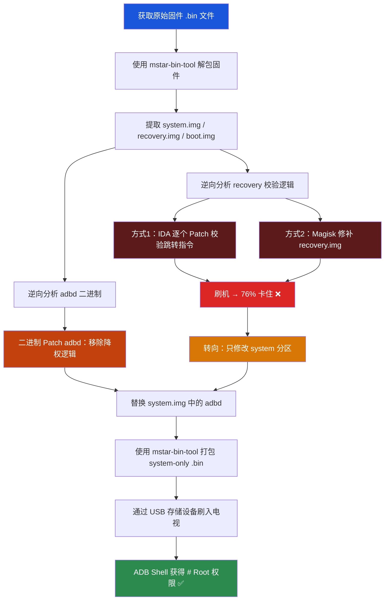

## 二、思路和逐步递进的方案

### 2.1 核心问题：为什么第一步是绕过 Recovery 中的校验？

这台电视**唯一可用的刷机方式**是 USB 离线刷（U 盘插电视，电视自动识别 `.bin` 文件并刷入）。在刷入过程中，**recovery 程序负责将 `.bin` 中的分区镜像写入 eMMC**。

通过 IDA 逆向 recovery 二进制，确认其中存在签名校验逻辑（RSA/EC/whole-file 三种签名验证）。这意味着：**如果修改了任何分区镜像，校验就可能失败，刷机就会被拒绝**。

所以，不管最终要修改哪个分区（recovery、boot 还是 system），第一步都是：**绕过 recovery 中的校验，确保修改过的包能被成功刷入**。

> [!NOTE]
> 这个推理在当时是完全合理的 — 无法事先知道校验的粒度。也许 recovery 对所有分区（包括 system）都做签名验证，也许只对部分分区做。不试就不知道。

### 2.2 绕过 Recovery 校验的两个方式

确定了"必须先绕过 Recovery 校验"之后，有两条路线可以尝试：

**方式 1：IDA 逆向 + 二进制 Patch**

通过 IDA Pro 对 recovery 二进制进行逆向分析，定位到签名校验函数 `sub_457E8`，找到所有校验跳转点，逐个修改跳转指令（BEQ→BNE、CBZ→CBNZ 等），从代码层面绕过校验逻辑。

**方式 2：Magisk 修补**

使用 Magisk 直接修补 recovery.img（因为 Magisk 检测不到 boot 分区的 ramdisk，实际修补的是 recovery），替换掉整个 recovery 镜像。

### 2.3 综合步骤规划

基于以上分析，制定了完整的执行计划：

```
A. Recovery 校验绕过（方式 1 或 方式 2）
   1. 解包获取 recovery.img
   2. 绕过 recovery 签名校验           ← 必须先过这关
   3. 重打包 recovery.img

B. System 修改
   1. 逆向分析 adbd，确定 Patch 方案
   2. 替换 /system/bin/ 下的 adbd

C. 重新打包升级包（.bin 文件）

D. 刷机
```

> [!IMPORTANT]
> 其实从一开始，"直接修改 system 分区"就被认为是**风险最小、成功率最高**的方案。但当时的认知是：不管修改哪个分区，都需要通过 USB 刷入，而刷入时 recovery 中的校验程序会验证所有分区。所以第一步必须先绕过 recovery 校验。

---

## 三、尝试

尝试分为两大部分：**Recovery 校验绕过**和**System 分区修改**。

### Part A：Recovery 校验绕过

#### 3.1 发现关键事实：分区命名错位

在解包过程中发现了一个重要信息：

> **T7G 的分区命名与实际用途是反的**
> - 刷机包中标记为 "recovery" 的分区 → 实际是 boot（包含 kernel + ramdisk，正常启动用）
> - 刷机包中标记为 "boot" 的分区 → ramdisk 为空，实际是 recovery

分区布局：`mboot → mbootbak → recovery(实际是boot) → boot(实际是recovery) → optee`

这直接影响了后续 Magisk 的修补对象 — Magisk 检测不到 ramdisk（因为 boot 分区的 ramdisk 为空），所以需要修补 recovery（即实际的 boot 分区）。

#### 3.2 尝试 1：Recovery 签名校验绕过 — 单处跳转修改

通过 IDA 定位到签名校验函数，找到第一个校验点：

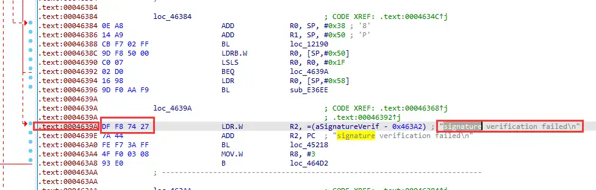

```
.text:00046392  02 D0  BEQ  loc_4639A
```

修改为 `02 D1`（BEQ → BNE），反转跳转逻辑。

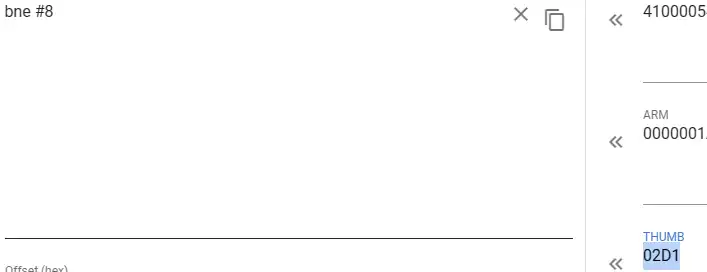

**结果**：刷机到 **76% 卡住** ❌

> [!NOTE]
> **关键观察**：直接解包重打包刷机50%就卡住，修改第1个签名校验之后刷入修改过的完整包时，进度条能走到 76% 才卡住，说明 **修改有效**

#### 3.3 尝试 2：Recovery 签名校验绕过 — 双处跳转修改

进一步分析 CFG，发现最初的改法"只是在报错日志那里不进去，但整个逻辑已经走进了错误分支"。重新定位，从源头跳过错误分支：

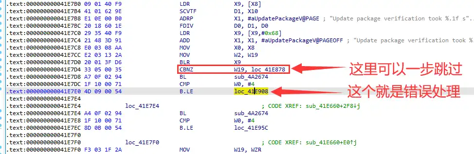

| 修改 | 地址 | 原始 → 修改 | 指令变化 |
|------|------|------------|---------|
| 修改 1 | `0x46CDA` | `54 B3` → `54 BB` | CBZ → CBNZ |
| 修改 2 | `0x46266` | `65 D0` → `65 D1` | BEQ → BNE |

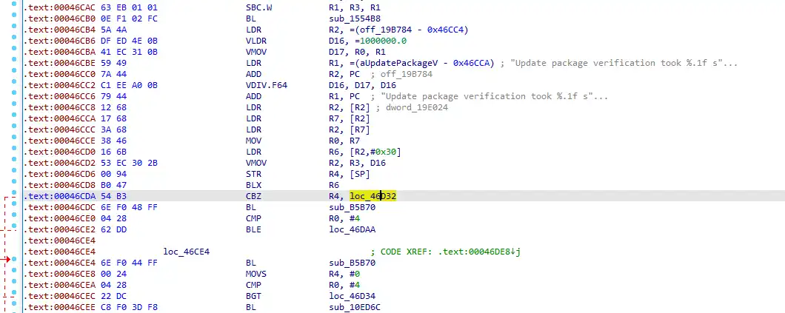

**结果**：76% 卡住，但行为变了 — 不再重复刷机，直接关机 ❌

修改刷机脚本中的 recovery 长度后再试 → 76% 卡住，恢复为重复刷机行为。

#### 3.4 尝试 3：Magisk 修补 Recovery

既然手动 Patch 校验代码没效果，转向 Magisk 修补路线：

- 安装 Magisk，用它修补 recovery.img（因为 Magisk 检测不到 ramdisk，修补的是 recovery）

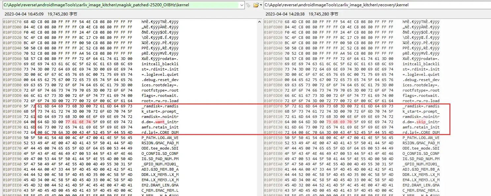
3. 直接替换，不改脚本长度 → 76% 卡住，直接关机
4. 修改脚本中的长度 → 76% 卡住，开始重复刷机
5. 使用 Magisk 修补的 recovery + 更新长度 → 76% 卡住，直接关机

**结果**：全部 76% 卡住 ❌

#### 3.5 尝试 4：分区空间分析 — 发现物理约束

在继续尝试替换 recovery 之前，先做了详细的分区空间分析：

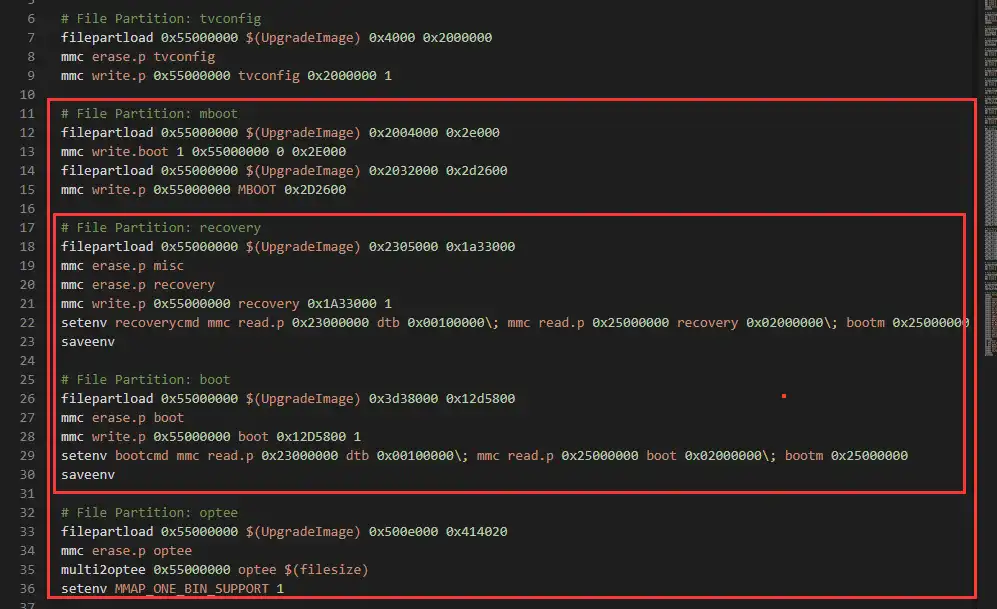

```
分区布局：mbootbak → recovery(实际boot) → boot(实际recovery) → optee

最大可用空间 = optee起始 - mbootbak结束
            = 0x500E000 - 0x2304600
            = 0x2D09A00

原始 boot + recovery = 0x12D5800 + 0x1A33000 = 0x2D08800

空闲空间 = 仅 4,608 字节
```

而 Magisk 修补后的 boot 镜像从 `0x109D800` 增大到 `0x1114000`，**增大了约 485KB**。分区间隙只有不到 5KB，物理层面根本放不下。

另外还发现了分区起始地址的 **0x800 对齐偏移**问题：每个分区的实际写入起始地址比理论计算值向前偏移了 0x800 字节。

**结论**："替换 recovery 的方式搞不了，空间不够"  ❌

#### 3.6 尝试 5：分区顺序交换

既然空间不够放修补后的大镜像，尝试交换 boot 和 recovery 的位置：

重新计算交换后的起始地址：
```
boot分区写recovery文件：0x500E000 - 0x1A33000 - 0x800 = 0x35DA800
recovery分区写boot文件：0x35DA800 - 0x12D5800 = 0x2305000（和原来一样）
```

修改刷机脚本中的分区名称和地址。

**结果**：**50% 卡住**（比之前更早失败）❌

#### 3.7 尝试 6：修改 Recovery 分区大小再刷

用修补后稍小一些的 recovery 镜像（`0x1A2F800`，比原始的 `0x1A33000` 还短），重新计算起始地址。

**结果**：76% 卡住 ❌

#### 3.8 尝试 7：完整 CFG 分析 + 三处跳转修改

决定做最后一次全面尝试。对签名校验函数 `sub_457E8` 的完整控制流图（CFG）进行颜色标注分析：

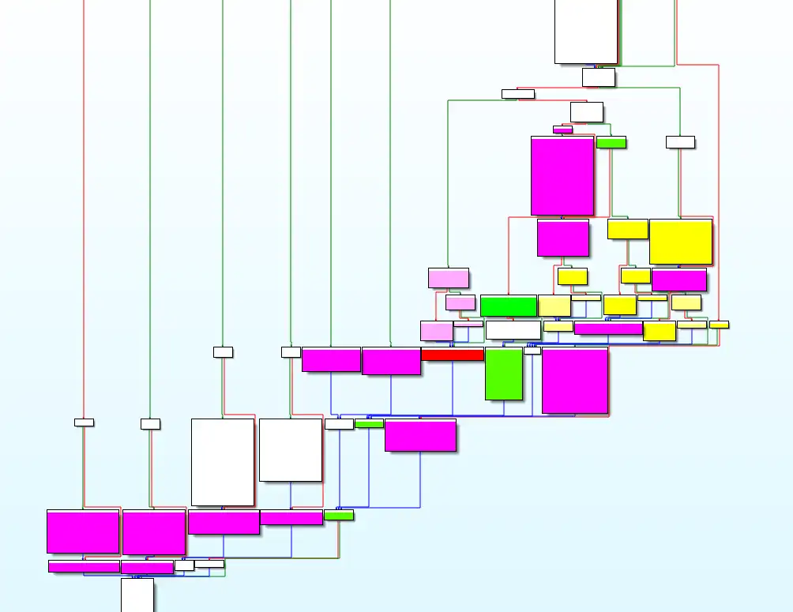

确定必须修改 **3 处跳转**才能完全绕过：

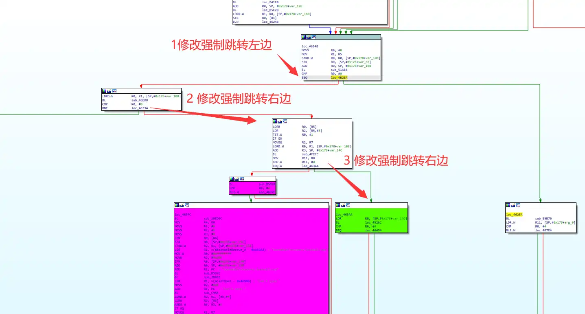

| 跳转 | 地址 | 修改 | 说明 |
|------|------|------|------|
| 第 1 个 | `0x46284` | `00 F0 91 80` → `00 F0 91 B8` | BEQ.W → B.W（无条件跳转） |
| 第 2 个 | `0x46266` | `65 D0` → `65 D1` | BEQ → BNE（已修改） |
| 第 3 个 | 校验函数内 | 多处 | 跳过 RSA/EC/whole-file 验证 |

修改后的目标流程：

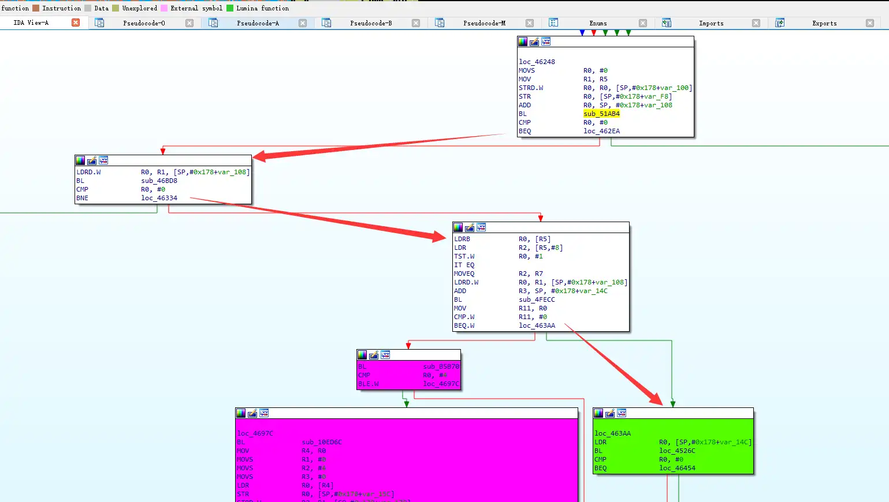

同时在 system 中也替换了 recovery 和 adbd（`/system/etc/recovery.img` 也进行了替换）。

**结果**："76% 卡住，**不是这里校验的**"  ❌

> [!IMPORTANT]
> **关键结论**：经过这一轮最彻底的修改（3 处跳转全部绕过），76% 仍然卡住。这证明了 **76% 卡住的问题根本不是 recovery 二进制中的签名校验导致的**。还存在另一层校验 — 很可能是 MBOOT（引导加载程序）层面的独立 RSA 签名验证。

**结果**：**GG**  recovery 校验绕过路线彻底失败 ❌

---

### Part B：转向 System 分区修改

#### 3.10 关键转折：回到方法列表

在尝试了所有 recovery/boot 修改路线后，停下来重新罗列方法：

```
4个方法：
  1. 单独刷某个分区
     A. 单独刷 system           ← 这个！
     B. 刷原版 system
  2. boot 中给他加上修补过的 ramdisk
     → 看完了，分区空间不够
  3. 替换修补的 recovery
     → 看完了，分区空间不够
  4. 分析第 2 次校验的位置
```

方法 2 和 3 因分区空间不够被排除，方法 4 在前面已经反复尝试失败。**只剩下方法 1A：单独刷 system**。

#### 3.11 adbd 逆向分析 — 确定 System 中需要改什么

要修改 system 实现 Root，核心目标是让 `adb shell` 以 Root 权限运行。通过 IDA Pro 对 `/system/bin/adbd` 进行逆向分析，发现了关键信息：

**标准 AOSP 的 adbd**：通过 `should_drop_privileges()` 方法检查 `ro.secure`、`ro.debuggable`、`service.adb.root` 等属性来决定是否降权。

**TCL User 版本的 adbd**：
- **删除了** `should_drop_privileges()` 的条件判断
- 在 `adbd_main()` 中**直接调用** `minijail_new` 等降权函数
- 不依赖任何系统属性 → 设置 `ro.secure=0` 或 `service.adb.root=1` **完全无效**

**↓ AOSP 标准逻辑 — `should_drop_privileges()` 通过属性判断是否降权，TCL User 版本删除了这个判断：**

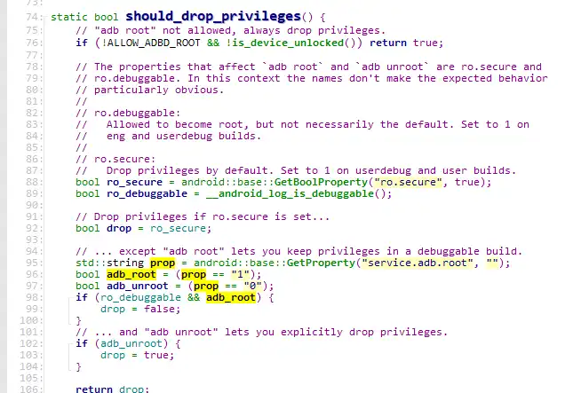

**↓ AOSP 标准逻辑 — `drop_privileges()` 中的 minijail 降权代码，TCL 在 adbd_main 中直接无条件调用这段逻辑：**

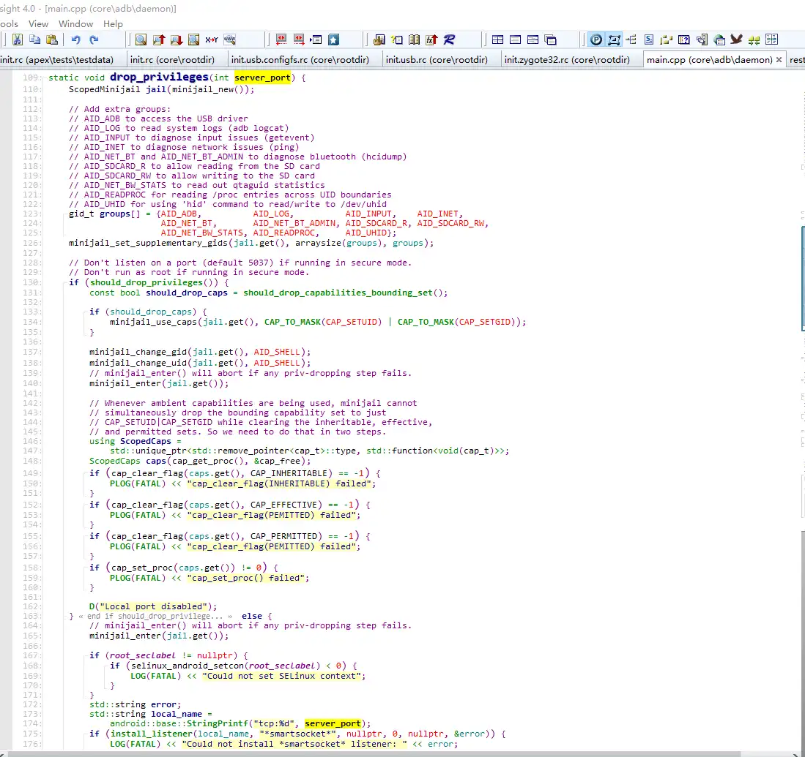
TCL逻辑：
![[TCL_75T7G_Root_Process_Analysis_GitHub-1778559141028.webp]]

这意味着 Root 不能通过修改属性实现，**须对 adbd 二进制本身进行 Patch**。

Patch 方案确定为：
- **Patch 1**：将 `BL minijail_new`（`0xB8F0`）改为 `B #0x128; NOP`，跳过整个降权代码块
- **Patch 2**：将 `CMP R5, #0`（`0x2250`）改为 `B #0x15A`，跳过 `drop_privileges` 条件判断

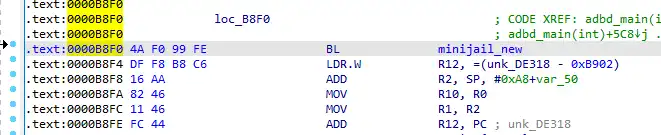

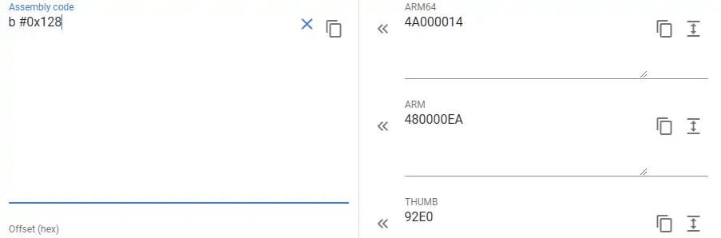

**在另一台 Android 工程机上验证**：直接替换 Patch 后的 adbd → ADB Shell 立即显示 `#`（Root）。Patch 方案完全可行。
#### 3.12 最终方案：制作 System-only 增量刷机包

使用 `mstar-bin-tool` 的 `pack.py` 配合自定义配置 `tcl-t7g-system.ini`，只打包 system 分区：

```
1. 解包 system.img
2. Mount system.img
3. 替换 /system/bin/adbd 为 Patch 后的版本
4. Umount、验证 MD5
5. 使用 pack.py + tcl-t7g-system.ini 打包为 .bin 文件
6. U 盘刷入电视
```

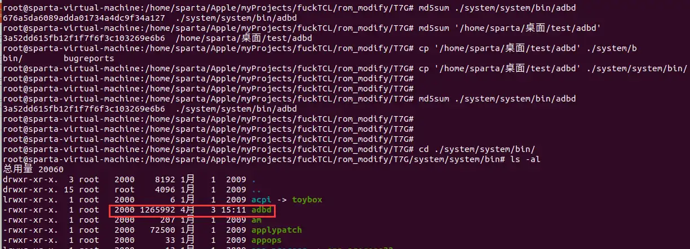

关键配置 — `tcl-t7g-system.ini` 中只有 system 分区，**没有 secureInfo、没有 boot、没有 recovery**：

```ini
[part/system]
erase=True
imageFile=${Main:ProjectFolder}/system.img
type=partitionImage
sparse=True
chunkSize=150MB
```

---

## 四、结果

### 4.1 成功

刷机完成后：
```
$ adb shell
#                    ← 直接就是 Root Shell
```

**ADB Shell 提示符直接为 `#`（Root 权限）**，无需执行 `adb root` 命令。

### 4.2 为什么 System-only 方案能成功？— `.bin` 包文件结构分析

从 `pack.py` 源码可以看到，MStar `.bin` 固件的二进制结构为：

```
┌─────────────────────────────────────────────┐
│  Header (16KB)                              │
│  ├─ MBOOT U-Boot 命令脚本                    │
│  │  (filepartload, mmc write.p, erase.p...) │
│  └─ 填充 0xFF 至 16KB                        │
├─────────────────────────────────────────────┤
│  Binary Data (变长)                          │
│  ├─ [Partition 1 data, 4-byte aligned]      │
│  ├─ [Partition 2 data, 4-byte aligned]      │
│  └─ ...                                     │
├─────────────────────────────────────────────┤
│  Footer (28 bytes)                          │
│  ├─ MAGIC: "12345678" (8 bytes)             │
│  ├─ CRC1: CRC32(Header) (4 bytes)          │
│  ├─ CRC2: CRC32(Header+Bin+MAGIC+CRC1)     │  ← XGIMI/TCL 模式
│  └─ Header 前 16 字节 (16 bytes)             │
└─────────────────────────────────────────────┘
```

> [!IMPORTANT]
> **关键发现**：整个 `.bin` 包的完整性验证**仅依赖 CRC32**
>
> CRC32 是一个**错误检测码**，不是密码学签名。只要你能正确计算 CRC32 值（`pack.py` 中的 `binascii.crc32()` 就能做到），生成的 `.bin` 文件就能通过 MBOOT 的包级校验。
>
> 这意味着：**任何人都可以构造一个格式正确的 `.bin` 刷机包**，只要 CRC32 计算正确。

对比完整刷机包配置（`letv-x355pro-full.ini`）和 T7G system-only 配置（`tcl-t7g-system.ini`）：

| 分区 | 完整刷机包 | T7G system-only | 说明 |
|------|-----------|-----------------|------|
| boot | `partitionImage` + **`bootSign`** (secureInfo) | 不包含 | 有 RSA 签名保护 |
| recovery | `partitionImage` + **`recoverySign`** (secureInfo) | 不包含 | 有 RSA 签名保护 |
| tee | `partitionImage` + **`teeSign`** (secureInfo) | 不包含 | 有 RSA 签名保护 |
| **system** | `partitionImage` **（无 Sign）** | `partitionImage` **（无 Sign）** | **无 RSA 签名保护！** |

完整刷机包中，boot/recovery/tee 都有对应的 `xxxSign` 签名分区，使用 `store_secure_info` 指令写入，写入后 MBOOT 会在后续启动时验证。而 **system 分区在任何配置中都没有对应的签名分区**。

这就是为什么：
- 修改 recovery → 刷入时 76% 卡住（RSA 签名验证失败）
- 修改 system → 刷入成功（只需通过 CRC32 包级校验）

> [!TIP]
> **所以"随便制作一个刷机包就可以刷机"，对于 system 分区来说，基本成立。** 只要：
> 1. `.bin` 文件格式正确（Header + Data + Footer）
> 2. Header 中的 MBOOT 命令语法正确（filepartload、mmc write.p 等）
> 3. CRC32 计算正确
>
> 就可以成功将 system 分区写入。这是 MStar 平台固件安全架构的一个设计缺陷——它只对启动链关键分区（boot/recovery/tee）做了密码学保护，而对 system 分区只做了完整性校验（CRC32）。

---

## 五、补充信息

### 5.1 为什么 mstar-bin-tool 能解包这个固件？

MStar（现 MediaTek）向电视厂商提供芯片 SDK 时，附带了一套**默认的 AES 和 RSA 密钥**（用于加密和签名 boot/recovery 等关键分区）。正常做法是厂商拿到 SDK 后用自己的密钥替换默认密钥，但 TCL（至少在 MT9652 产品线上）**直接使用了 SDK 默认密钥，没有替换**。

`mstar-bin-tool` 的作者从 GitHub 上多个公开仓库中收集到了这些默认密钥（`default_keys/` 目录），所以它天然能解包任何使用默认密钥的厂商固件。这不是 TCL 特有的问题 — LeEco、XGIMI、DEXP 等品牌同样未替换默认密钥。

> [!NOTE]
> 对于最终成功的 **system-only 刷机包**场景，其实**连密钥都不需要**。`pack.py` 对 system 分区只做了 Header 脚本拼接 + 数据写入 + CRC32 计算。密钥只在处理有 `secureInfo` 签名的分区（boot/recovery/tee）时才用到。
