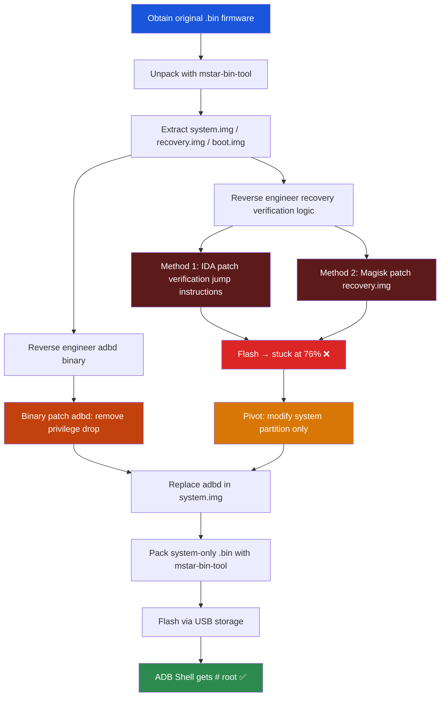

**[中文](README.md)** | **English**

# Rooting TCL 75T7G TV — Full Process Analysis

> **Device**: TCL 75T7G (V8-T652T01-LF1V379, MStar MT9652, Android 9.0)
> **Completed**: April 2023
> **Report compiled**: 2026-05-12 (based on original working notes)

> [!CAUTION]
> **Disclaimer**
>
> This was a personal project to root an old TV at home, for learning and research purposes only. Commercial use is strictly prohibited. The author assumes no responsibility for any consequences. If there are any privacy or security concerns, please contact me.

---

## 1. Background

### 1.1 Device Constraints

Compared to a typical Android engineering device (with Recovery/Bootloader/Fastboot modes, where rooting takes 2 minutes), the TCL 75T7G has the following limitations:

- ❌ No Fastboot mode — cannot `fastboot flash`
- ❌ No Bootloader unlock — cannot unlock the bootloader
- ❌ No Recovery mode entry — cannot enter standard Android Recovery
- ❌ No USB cable response — no ADB device appears
- ❌ No firmware available online — cannot obtain firmware from the internet
- ❌ adbd hardcoded privilege drop — User build drops privileges unconditionally in code, ignoring all property checks

**The only available flashing method**: Place a `.bin` firmware file on a USB drive, plug it into the TV, and the TV automatically detects and flashes it.

### 1.2 Tools

- **Firmware**: `V8-T652T01-LF1V379.bin`
- **mstar-bin-tool**: Open-source GitHub tool for unpacking/packing MStar `.bin` firmware
- **IDA Pro**: Reverse engineering `adbd` and recovery binaries
- **010 Editor**: Hex editor for binary patching

### 1.3 Overall Root Technical Route



## 2. Approach & Progressive Strategy

### 2.1 Core Question: Why bypass Recovery verification first?

The **only available flashing method** for this TV is offline USB flashing (plug USB drive into TV, TV auto-detects `.bin` file). During flashing, the **recovery program is responsible for writing partition images from the `.bin` file to eMMC**.

Through IDA reverse engineering of the recovery binary, signature verification logic was confirmed (RSA/EC/whole-file — three types of signature verification). This means: **if any partition image is modified, verification may fail and flashing will be rejected**.

Therefore, regardless of which partition needs to be modified (recovery, boot, or system), the first step must be: **bypass recovery verification to ensure modified packages can be successfully flashed**.

> [!NOTE]
> This reasoning was entirely sound at the time — there was no way to know the verification granularity in advance. Perhaps recovery verifies all partitions (including system), perhaps only some. You can't know without trying.

### 2.2 Two Approaches to Bypass Recovery Verification

After determining "Recovery verification must be bypassed first," two paths were available:

**Method 1: IDA Reverse Engineering + Binary Patch**

Use IDA Pro to reverse engineer the recovery binary, locate the signature verification function `sub_457E8`, find all verification branch points, and modify jump instructions one by one (BEQ→BNE, CBZ→CBNZ, etc.) to bypass verification logic at the code level.

**Method 2: Magisk Patch**

Use Magisk to directly patch recovery.img (since Magisk cannot detect the boot partition's ramdisk, it actually patches recovery), replacing the entire recovery image.

### 2.3 Execution Plan

Based on the above analysis, a complete execution plan was formulated:

```
A. Recovery verification bypass (Method 1 or Method 2)
   1. Unpack to obtain recovery.img
   2. Bypass recovery signature verification    ← must pass this first
   3. Repack recovery.img

B. System modification
   1. Reverse engineer adbd, determine patch strategy
   2. Replace adbd under /system/bin/

C. Repack upgrade package (.bin file)

D. Flash
```

> [!IMPORTANT]
> From the very beginning, "directly modifying the system partition" was considered the **lowest risk, highest success probability** approach. However, the understanding at the time was: regardless of which partition is modified, it needs to be flashed via USB, and during flashing the recovery verification program would verify all partitions. Therefore, bypassing recovery verification had to come first.

---

## 3. Attempts

Attempts are divided into two major parts: **Recovery verification bypass** and **System partition modification**.

### Part A: Recovery Verification Bypass

#### 3.1 Key Discovery: Partition Name Mismatch

During unpacking, an important piece of information was discovered:

> **T7G's partition names are reversed from their actual purposes!**
> - Partition labeled "recovery" in the firmware → actually boot (contains kernel + ramdisk, used for normal boot)
> - Partition labeled "boot" in the firmware → ramdisk is empty, actually recovery

Partition layout: `mboot → mbootbak → recovery(actually boot) → boot(actually recovery) → optee`

This directly affected the Magisk patching target — Magisk couldn't detect a ramdisk (because the boot partition's ramdisk is empty), so it needed to patch recovery (which is actually the boot partition).

#### 3.2 Attempt 1: Recovery Signature Bypass — Single Jump Modification

Located the signature verification function via IDA, found the first checkpoint:


```
.text:00046392  02 D0  BEQ  loc_4639A
```

Changed to `02 D1` (BEQ → BNE), reversing the jump logic.


**Result**: Stuck at **76%** during flashing ❌

> [!NOTE]
> **Key observation**: A plain unpack-repack flash would get stuck at 50%. After modifying the first signature verification, the progress bar reached 76% before getting stuck, indicating the **modification had an effect**.

#### 3.3 Attempt 2: Recovery Signature Bypass — Double Jump Modification

Further CFG analysis revealed the initial fix "only prevented entering the error log, but the logic had already entered the error branch." Repositioned to skip the error branch from the source:


| Modification | Address | Original → Modified | Instruction Change |
|------|------|------------|---------|
| Mod 1 | `0x46CDA` | `54 B3` → `54 BB` | CBZ → CBNZ |
| Mod 2 | `0x46266` | `65 D0` → `65 D1` | BEQ → BNE |


**Result**: Stuck at 76%, but behavior changed — no longer repeats flashing, shuts down directly ❌

After modifying the recovery length in the flashing script → stuck at 76%, returned to repeating flash behavior.

#### 3.4 Attempt 3: Magisk Patching Recovery

Since manually patching verification code had no effect, switched to the Magisk patching route:

- Installed Magisk, used it to patch recovery.img (since Magisk couldn't detect ramdisk, it patched recovery)


3. Direct replacement, no script length change → stuck at 76%, shutdown
4. Modified script length → stuck at 76%, started repeating flash
5. Magisk-patched recovery + updated length → stuck at 76%, shutdown

**Result**: All stuck at 76% ❌

#### 3.5 Attempt 4: Partition Space Analysis — Physical Constraints

Before continuing recovery replacement attempts, performed detailed partition space analysis:


```
Partition layout: mbootbak → recovery(actual boot) → boot(actual recovery) → optee

Max available space = optee_start - mbootbak_end
                    = 0x500E000 - 0x2304600
                    = 0x2D09A00

Original boot + recovery = 0x12D5800 + 0x1A33000 = 0x2D08800

Free space = only 4,608 bytes
```

The Magisk-patched boot image grew from `0x109D800` to `0x1114000`, **an increase of ~485KB**. With less than 5KB of inter-partition gap, it physically cannot fit.

Additionally discovered a **0x800 alignment offset** issue with partition start addresses: each partition's actual write start address is offset by 0x800 bytes from the theoretical calculated value.

**Conclusion**: "Recovery replacement won't work, not enough space" ❌

#### 3.6 Attempt 5: Partition Order Swap

Since there's not enough space for the patched larger image, attempted swapping boot and recovery positions:

Recalculated start addresses after swap:
```
boot partition writes recovery file: 0x500E000 - 0x1A33000 - 0x800 = 0x35DA800
recovery partition writes boot file: 0x35DA800 - 0x12D5800 = 0x2305000 (same as before)
```

Modified partition names and addresses in the flashing script.

**Result**: **Stuck at 50%** (failed even earlier) ❌

#### 3.7 Attempt 6: Modified Recovery Partition Size

Used a slightly smaller patched recovery image (`0x1A2F800`, shorter than the original `0x1A33000`), recalculated start addresses.

**Result**: Stuck at 76% ❌

#### 3.8 Attempt 7: Complete CFG Analysis + Three Jump Modifications

Decided on one final comprehensive attempt. Performed color-coded analysis of the complete control flow graph (CFG) for signature verification function `sub_457E8`:


Determined that **3 jumps** must be modified to fully bypass:


| Jump | Address | Modification | Description |
|------|------|------|------|
| 1st | `0x46284` | `00 F0 91 80` → `00 F0 91 B8` | BEQ.W → B.W (unconditional jump) |
| 2nd | `0x46266` | `65 D0` → `65 D1` | BEQ → BNE (already modified) |
| 3rd | Within verification function | Multiple | Skip RSA/EC/whole-file verification |

Target flow after modifications:


Also replaced recovery and adbd in system (`/system/etc/recovery.img` was also replaced).

**Result**: "Stuck at 76%, **verification is not here**" ❌

> [!IMPORTANT]
> **Key conclusion**: After the most thorough modification (all 3 jumps bypassed), 76% still stuck. This proves **the 76% issue is not caused by signature verification in the recovery binary**. There exists another verification layer — most likely independent RSA signature verification at the MBOOT (bootloader) level.

**Result**: **GG** — Recovery verification bypass route completely failed ❌

---

### Part B: Pivoting to System Partition Modification

#### 3.10 Key Turning Point: Back to Method List

After exhausting all recovery/boot modification routes, stopped to re-list methods:

```
4 methods:
  1. Flash individual partition
     A. Flash system only              ← This one!
     B. Flash stock system
  2. Add patched ramdisk to boot
     → Done checking, not enough partition space
  3. Replace with patched recovery
     → Done checking, not enough partition space
  4. Analyze location of 2nd verification
```

Methods 2 and 3 were eliminated due to insufficient partition space, Method 4 had been repeatedly attempted and failed. **Only Method 1A remained: flash system only**.

#### 3.11 adbd Reverse Engineering — Determining What to Modify in System

To achieve root by modifying system, the core goal is to make `adb shell` run with root privileges. Through IDA Pro reverse engineering of `/system/bin/adbd`, key information was discovered:

**Standard AOSP adbd**: Uses `should_drop_privileges()` to check properties like `ro.secure`, `ro.debuggable`, `service.adb.root` to decide whether to drop privileges.

**TCL User build adbd**:
- **Removed** the `should_drop_privileges()` conditional check
- **Directly calls** `minijail_new` and other privilege-dropping functions in `adbd_main()`
- Does not depend on any system properties → setting `ro.secure=0` or `service.adb.root=1` is **completely ineffective**

**↓ AOSP standard logic — `should_drop_privileges()` determines privilege drop via properties; TCL User build removed this check:**


**↓ AOSP standard logic — `drop_privileges()` minijail privilege drop code; TCL unconditionally calls this logic directly in adbd_main:**


This means root cannot be achieved by modifying properties — **the adbd binary itself must be patched**.

Patch strategy:
- **Patch 1**: Change `BL minijail_new` (`0xB8F0`) to `B #0x128; NOP`, skipping the entire privilege drop code block
- **Patch 2**: Change `CMP R5, #0` (`0x2250`) to `B #0x15A`, skipping the `drop_privileges` conditional


**Verified on another Android engineering device**: Directly replaced with patched adbd → ADB Shell immediately shows `#` (root). Patch strategy fully viable.

#### 3.12 Final Solution: Building a System-only Incremental Flash Package

Using `mstar-bin-tool`'s `pack.py` with custom configuration `tcl-t7g-system.ini`, packaging only the system partition:

```
1. Unpack system.img
2. Mount system.img
3. Replace /system/bin/adbd with patched version
4. Umount, verify MD5
5. Use pack.py + tcl-t7g-system.ini to package as .bin file
6. Flash via USB drive
```


Key configuration — `tcl-t7g-system.ini` contains only the system partition, **no secureInfo, no boot, no recovery**:

```ini
[part/system]
erase=True
imageFile=${Main:ProjectFolder}/system.img
type=partitionImage
sparse=True
chunkSize=150MB
```

---

## 4. Result

### 4.1 Success

After flashing:
```
$ adb shell
#                    ← Root shell directly
```

**ADB Shell prompt is directly `#` (root privileges)**, no need to execute `adb root`.

### 4.2 Why the System-only Approach Worked — `.bin` File Structure Analysis

From `pack.py` source code, the binary structure of MStar `.bin` firmware is:

```
┌─────────────────────────────────────────────┐
│  Header (16KB)                              │
│  ├─ MBOOT U-Boot command script             │
│  │  (filepartload, mmc write.p, erase.p...) │
│  └─ Padded with 0xFF to 16KB               │
├─────────────────────────────────────────────┤
│  Binary Data (variable length)              │
│  ├─ [Partition 1 data, 4-byte aligned]      │
│  ├─ [Partition 2 data, 4-byte aligned]      │
│  └─ ...                                     │
├─────────────────────────────────────────────┤
│  Footer (28 bytes)                          │
│  ├─ MAGIC: "12345678" (8 bytes)             │
│  ├─ CRC1: CRC32(Header) (4 bytes)          │
│  ├─ CRC2: CRC32(Header+Bin+MAGIC+CRC1)     │  ← XGIMI/TCL mode
│  └─ First 16 bytes of Header (16 bytes)     │
└─────────────────────────────────────────────┘
```

> [!IMPORTANT]
> **Key discovery**: The entire `.bin` package integrity verification **relies solely on CRC32**!
>
> CRC32 is an **error detection code**, not a cryptographic signature. As long as you can correctly calculate the CRC32 value (`binascii.crc32()` in `pack.py` does this), the generated `.bin` file will pass MBOOT's package-level verification.
>
> This means: **anyone can construct a correctly formatted `.bin` flash package**, as long as CRC32 is calculated correctly.

Comparing full flash package configuration (`letv-x355pro-full.ini`) with T7G system-only configuration (`tcl-t7g-system.ini`):

| Partition | Full Package | T7G system-only | Notes |
|------|-----------|-----------------|------|
| boot | `partitionImage` + **`bootSign`** (secureInfo) | Not included | RSA signature protected |
| recovery | `partitionImage` + **`recoverySign`** (secureInfo) | Not included | RSA signature protected |
| tee | `partitionImage` + **`teeSign`** (secureInfo) | Not included | RSA signature protected |
| **system** | `partitionImage` **(no Sign)** | `partitionImage` **(no Sign)** | **No RSA signature protection!** |

In the full flash package, boot/recovery/tee all have corresponding `xxxSign` signature partitions, written using `store_secure_info` instructions, which MBOOT verifies on subsequent boots. However, **the system partition has no corresponding signature partition in any configuration**.

This is why:
- Modifying recovery → stuck at 76% during flashing (RSA signature verification failed)
- Modifying system → flashing succeeds (only needs to pass CRC32 package-level verification)

> [!TIP]
> **So "just build any flash package and it'll work" is essentially true for the system partition.** As long as:
> 1. The `.bin` file format is correct (Header + Data + Footer)
> 2. MBOOT commands in the Header are syntactically correct (filepartload, mmc write.p, etc.)
> 3. CRC32 is calculated correctly
>
> The system partition can be successfully written. This is a design flaw in the MStar platform's firmware security architecture — it only provides cryptographic protection for boot chain critical partitions (boot/recovery/tee), while system only has integrity checking (CRC32).

---

## 5. Supplementary Information

### 5.1 Why can mstar-bin-tool unpack this firmware?

When MStar (now MediaTek) provides chip SDKs to TV manufacturers, it includes a set of **default AES and RSA keys** (for encrypting and signing critical partitions like boot/recovery). The normal practice is for manufacturers to replace the default keys with their own after receiving the SDK, but TCL (at least for the MT9652 product line) **used the SDK default keys directly without replacement**.

The author of `mstar-bin-tool` collected these default keys from multiple public GitHub repositories (in the `default_keys/` directory), so it can natively unpack any firmware using default keys. This is not unique to TCL — LeEco, XGIMI, DEXP and other brands similarly did not replace the default keys.

> [!NOTE]
> For the ultimately successful **system-only flash package** scenario, **keys aren't even needed**. `pack.py` only performs Header script concatenation + data writing + CRC32 calculation for the system partition. Keys are only used when processing partitions with `secureInfo` signatures (boot/recovery/tee).
